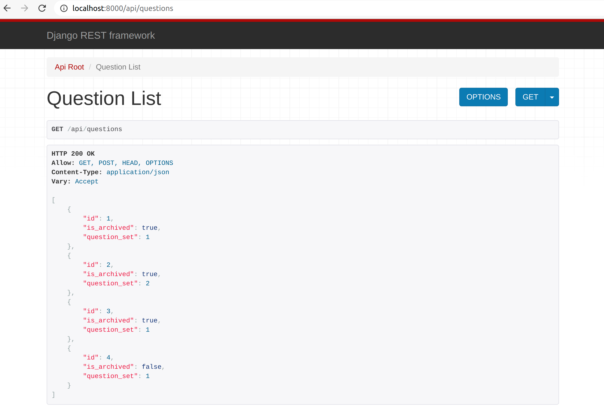
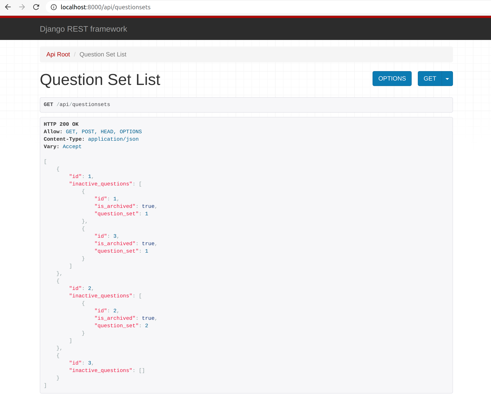

# Filter-django-queryset-by-its-related-field

a small demo project for a answer on stackoverflow (see: https://stackoverflow.com/questions/66152407/filter-django-queryset-by-its-related-field)

Note that question id 4 is not listed in questionset 1

